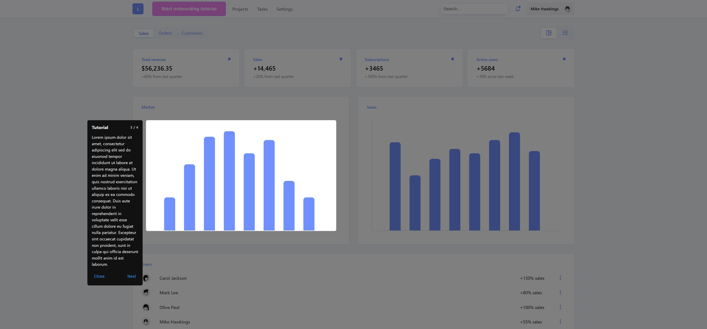

# React Wizard Onboarding

Pretty fancy onboarding wizard for your website, made in React.



# Installation

Install via npm

```sh
npm install --save react-wizard-onboarding
```

or yarn

```sh
yarn add react-wizard-onboarding
```

# Usage

1. Wrap your app inside the `<TutorialProvider>` context.

### Example

```typescript
const config = createTutorialConfig({ sticky: true, darkMode: true, displayDots: true, hideArrowOnSticky: true })

const Setup: React.FC = () => {
    return (
        <TutorialProvider config={config}>
            <App />
        </TutorialProvider>
    )
}

ReactDOM.createRoot(document.getElementById('root')!).render(<Setup />)
```

2. Register all the elements of a page to include them into the onboarding carousel.

### Example

```typescript
const { registerTutorialComponent, startTutorial } = useTutorial()
...

return (
    <div className="main-container">
        <header
            ref={registerTutorialComponent({
                position: 1,
                id: 'header',
                tutorialKey: 'main_tutorial',
                text: 'This is the header element...'
            })}
        >
    ...
)
```

3. Call the startTutorial method from useTutorial hook anywhere in the page (eg. with an onClick or a useEffect).

### Example

```html
    <button onClick={() => startTutorial()}>
        Start
    </button>
```

# Hooks

-   `registerTutorialComponent: (componentData: TutorialComponentData)` Registers a tutorial component to be highlighted during the onboarding steps.
-   `startTutorial: (tutorialKey?: string)` Starts the tutorial onboarding process. You can also specify which tutorial to start. If not specified, all the previously registered components will be highlighted during the onboarding process.

# Props

### `TutorialComponentData` connect a component to the onboarding process

| Name        | Optional | Type     | Description                                          |
| ----------- | -------- | -------- | ---------------------------------------------------- |
| id          |          | `string` | Component key or identifier                          |
| position    |          | `number` | Component chapter position in the onboarding wizard  |
| tutorialKey |          | `string` | Identifier of the onboarding tutorial chapters group |
| text        | ✔️       | `string` | Onboarding chapter text                              |
| iamge       | ✔️       | `string` | Onboarding chapter image                             |

### `TutorialConfiguration` configure the onboarding wizard UI

| Name        | Optional | Type                                                            | Description                                                                      |
| ----------- | -------- | --------------------------------------------------------------- | -------------------------------------------------------------------------------- |
| title       | ✔️       | `string`                                                        | Onboarding process title                                                         |
| sticky      | ✔️       | `boolean`                                                       | Determines if the wizard should stick to the registered components at each step. |
| darkMode    | ✔️       | `boolean`                                                       | Enables dark theme mode.                                                         |
| displayDots | ✔️       | `boolean`                                                       | Determines if page dots should be displayed in default mode (non-sticky only).   |
| labels      | ✔️       | `{ next?: string; complete?: string; close?: string }`          | Custom labels for the wizard buttons.                                            |
| icons       | ✔️       | `{ next?: ReactNode; complete?: ReactNode; close?: ReactNode }` | Custom icons for the wizard buttons.                                             |

# License

react-wizard-onboarding is MIT licensed.
